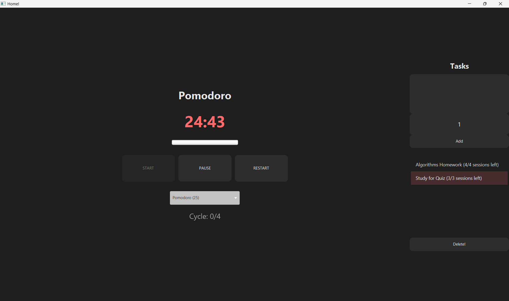

# Pomodoro Timer (JavaFX)

A desktop Pomodoro timer application built with JavaFX, featuring task tracking and persistent storage using SQLite.

## Features
- Pomodoro timer (25 min work / 5 min break)
- Task management system
- SQLite database integration
- Automatic task progress tracking
- Custom UI with JavaFX and CSS

## Tech Stack
- Java
- JavaFX
- SQLite
- JDBC

## Screenshots
(Add screenshots here if available)

## What I Learned
- JavaFX UI design and event handling
- Database integration with JDBC
- Structuring a desktop application using OOP principles
- Managing application state and persistence

## How to Run
```bash
./gradlew run
```

## Notes
Task data is stored locally using SQLite.

## Screenshot

